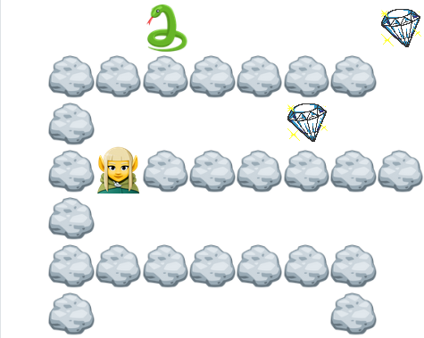

# Labyrinth Game

<!-- PROJECT LOGO -->
 

  

  <h3 align="center">Labyrinth Game</h3>

  

    Simple game web-project using React and MongoDB!
     
    <a href=[React-url]><strong>Explore the repository »</strong></a>
     
  

<!-- ABOUT THE PROJECT -->
## About The Project

[![Product Name Screen Shot][product-screenshot]](https://labyrintgame-frontend-tins.vercel.app/)

Labyrinth Game is a simple 2 dimensional singleplayer game.
Game rules:
* Game takes place in rectengular map of player determined size.
* There are 4 types of map cells: player, obstacle, prize and enemy.
* Places of each cell type are being generated randomly with each new game.
* Player can move in any free near (non-obstacle) cell, default keys are "W", "A", "S" and "D" for movements "Up", "Left", "Down" and "Right" respectively.
* When player steps in a prize cell, one score point is grandet to them.
* Enemies move to player. When player appears in a same cell as enemy game ends and collected scores are being added to players total score in database.

There are 4 unique themes avaliable: Standard, Halloween, New year and Space.

(<a href="#readme-top">back to top</a>)

### Built With

Following frameworks/libraries are used in the project.

* <a href=[React-url]><strong>React</strong></a> - frontend components
* <a href=[Mongoose-url]><strong>Mongoose</strong></a> - connection to MongoDB database
* <a href=[Express-validator-url]><strong>Express-validator</strong></a> - user input validation
* <a href=[Jsonwebtoken-url]><strong>Json Web Token</strong></a> - token based authentication
* <a href=[Bcrypt-url]><strong>Bcrypt</strong></a> - password encryption

(<a href="#readme-top">back to top</a>)

<!-- MARKDOWN LINKS & IMAGES -->
<!-- https://www.markdownguide.org/basic-syntax/#reference-style-links -->
[product-screenshot]: images/screenshot.png
[React-url]: https://reactjs.org/
[Express-validator-url]: https://express-validator.github.io/docs
[Mongoose-url]: https://mongoosejs.com/
[Jsonwebtoken-url]: https://www.npmjs.com/package/jsonwebtoken
[Bcrypt-url]: https://www.npmjs.com/package/bcrypt
